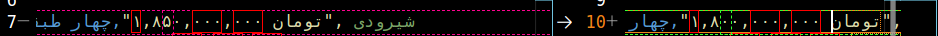

# یافته‌ها


**۳۰ دی ساعت های ۱ شب**

وقتی یک لینک مثل <a href = "https://divar.ir/s/mashhad/buy-residential">اینجا</a> رو باز می‌کنیم موارد زیادی برای نمایش وجود داره و همش در همون بخش اول بالا نمی‌یاد.
برای این که باقی آگهی‌ها بیاد در حالت عادی باید به پایین صفحه حرکت کنیم. خوب این طور برداشت می‌شه که باید از selenium استفاده کرد ولی به لطف یک چیزی که از یکی از دوستان یاد گرفتم احتمال دادم که مثل دیجیکالا بشه از یک بخش api مانندی (که انگار مال عموم نیست!) استفاده کرد.
ظاهرا توی این لینک اطلاعات جالبی هست و از طریق POST باید درخواست بشه
 یعنی احتمالا مثلا با کتابخونه request که پیش می‌ریم باید نوشت:
```page = request.post(url)```
ولی این و get فعلا امشب هیچ کدومشون نتیجه‌ای به من ندادن.

**۳۰ دی ساعت ۱۳**
ظاهرا اون api که می‌تونست اطلاعات رو برای ما بگیره یک سری اطلاعات به سمت سرور سایت دیوار می‌فرسته گرفته از query که نام محصول یا خدمت می‌تونه باشه تا فیلترهایی مثل شهر مد نظر و ...

مثلا لینک:

<a href = "https://api.divar.ir/v8/web-search/3/ROOT">https://api.divar.ir/v8/web-search/3/ROOT</a>
یک سری چیز باهاش ارسال می‌شه (اسمشون چیه هنوز نمی‌دونم)

{
	"json_schema": {
		"category": {
			"value": "ROOT"
		},
		"cities": [
			"3"
		],
		"query": "خانه"
	},
	"last-post-date": 1674209294091100
}

اینجامشکل ما این بخش ```last-post-date``` هست *یا شایدم چیز دیگه‌ای* ولی در هر صورت وقتی ریکوئست ارسال می‌شه در برگشت برامون خطای 406 می‌یاد.
فعلا می‌شه کاری کرد که همون ۱۰ ،۲۰ نتیجه اول که بالای صفحه می‌یاد رو دریافت کنیم.


**۱ بهمن ساعت ۲**

آگهی‌ها قابلیت ویرایش دارن. دیروز صبح <a href = "https://divar.ir/v/%DA%A9%D8%AA%D8%A7%D8%A8%D8%AE%D9%88%D8%A7%D9%86-%D9%81%DB%8C%D8%AF%DB%8C%D8%A8%D9%88_%D8%AA%D8%A8%D9%84%D8%AA_%D9%85%D8%B4%D9%87%D8%AF_%D8%B1%D8%A7%D9%87%D9%86%D9%85%D8%A7%DB%8C%DB%8C_%D8%AF%DB%8C%D9%88%D8%A7%D8%B1/wYInjFvn">این آگهی</a> ۳،۰۰۰،۰۰۰ تومن بود ولی الآن شده ۲،۵۰۰،۰۰۰ تومن پس برای استخراج داده‌ها و اطلاع دادنش به کاربر علاوه بر به وجود اومدن آگهی جدید تغییر وضعیت آگهی‌ها رو هم حتما باید در نظر گرفت.
حالا سؤال اینه که اگر یک کاربر آگهی رو ویرایش کنه. آیا توی api دیوار به عنوان آگهی جدید تر دوباره ارسال نمی‌شه؟

تغییر قیمت این خونه هم قابل توجه هستش. خود git تشخیص داده که تغییر کرده.
[](https://divar.ir/v/%DA%86%D9%87%D8%A7%D8%B1-%D8%B7%D8%A8%D9%82%D9%87-%D9%88%D8%A7%D8%B3%D9%87-%D9%81%D8%B1%D9%88%D8%B4-%D8%A2%D9%BE%D8%A7%D8%B1%D8%AA%D9%85%D8%A7%D9%86-%D8%B7%D8%A8%D9%82%D9%87-%D8%A7%D9%88%D9%84-110%D9%85%D8%AA%D8%B1-%D8%A8%D9%86%D8%A7_%D8%AE%D8%A7%D9%86%D9%87-%D9%88-%D9%88%DB%8C%D9%84%D8%A7_%D9%85%D8%B4%D9%87%D8%AF_%D8%B4%DB%8C%D8%B1%D9%88%D8%AF%DB%8C_%D8%AF%DB%8C%D9%88%D8%A7%D8%B1/wY4OwGxN)